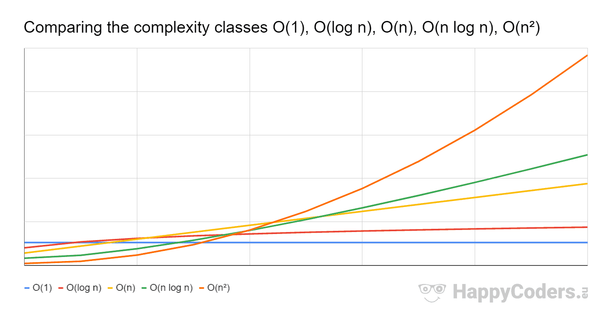

# Big O Notation 


## Objectives: 
- Motivate the need for it 
- Describe what Big O Notation is
- Simplify Big O Expressions
- Define "time complexity" and "space complexity" 
- Evaluate the time complexity and space complexity of different algorithms using Big O Notation 
- Describe what a logarithm is 

---
Big O
: We say that an algorithm is **O(f(n))** if the number of simple operations the computer has to do is eventually less than the constant times **f(n)**, as **n** increases

How do we determine what's best? That's what Big O is for. Think of it as a "scale" to determine what's best. Like a numeric representation. 

## Time Complexity 
- How can we analyze the runtime of an algorithm as the size of the imput increases

### The problem with time: 
- Different machines will record different times 
- The *same* machine will record different time!
- For fast algos, speed measure may not be precise enough? 
**This is where Big O comes into play**

- Let's count the # of simple operations the computer has to perform rather than counting seconds. 

```
Constant Time - O(1): 

EXAMPLE:
function addUpTo(n) {
    return n * (n + 1) / 2
}
//1-multiplication, 1-addition, 1-division
//3 simple operations, regardless of the size of n, remains constant O(1)

GRAPH:
function addUpTo(n){
	return n * (n+1) / 2
}

  t|
  i|
  m|______________________
  e|_________________________
        input size

```
---
```
Linear Time - O(n):

EXAMPLE: 
function addUpTo(n){
    let total = 0; 
    for(let i =1; i <= n; i++){
        total += i; 
    }
    return total 
}
//notice the loop here! 
//regards of the exact number, the number of operations grows roughly in proportion with n so O(n)
//for each input I have, I add ANOTHER operation 

GRAPH:
function addUpTo(n){
    let total = 0; 
    for(let i =1; i <= n; i++){
        total += i; 
    }
    return total 
}
  t|    /
  i|   /
  m|  /
  e| /
   |/_______________
         input size
```
---

## Key Takeaways
- *Constants don't matter! As we move towards infinity, constant become less and less significant. We find the HIGHEST ORDER or step with the worst performance*
- O(2n) -> O(n)
- O(500) -> O(1)
- O(13n<sup>2</sup>) -> O(n<sup>2</sup>)
- o(n<sup>2</sup> + 5n + 8) -> O(n<sup>2</sup>)

## Big O Shorthands (usually not always true):
1. Arithmetic ops are constant 
2. Variable assignments are constant
3. Accessing elements in an arr (by index) or object (by key) is constant
4. In a loop the complexity is the length of the loop times the complexity of whatever happens inside the loop.
---

## Objects and Arrays 

- *Objects* are an unordered data structure, stored in key value pairs. 
- Work well whe you don't need order and when you need fast insertion/removal (and acessing) data
- *Arrays* are ordered lists. Can come at a cost for some of the operations.


## Big O of Objects
- Insertion - O(1)
- Removal - O(1)
- Searching - O(n)
- Access - O(1)

## Big O of Object Methods 
- Object.keys - O(n)
- Object.values - O(n)
- Object.entries - O(n)
- hasOwnProperty - O(1)
---
## Big O of Arrays 
- Insertion - Depends on *WHERE* we are adding sonmething in. Adding to the *END* of an array is O(1). When we try to insert at the beginning, we have to go through and re-index the array, this takes time so insertion at the *beginning* is O(n)
- Removal - Depends on *WHERE*, same here, if removing from the *beginnin* same deal as insertion, gotta re-index the entire array so O(n)
- Searching - O(n)
- Access - O(1)

## Big O of Array Methods 
- Push - O(1)
- Pop - O(1)
- Shift - O(n)
- Unshift - O(n)
- Sort - O(n * log n)
- forEach/map/reduce/ you ghet the idea - O(n)

## Key Takeways 
1. Obj are fast at pretty much every but no order
2. Arrays are great when you need order and better to add/remove from the end all the other would require a re-index and that is slow yo 
 